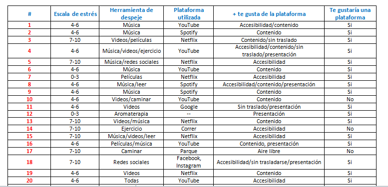
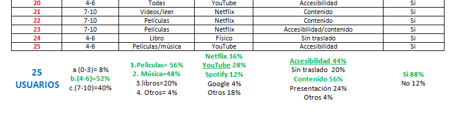

# _Entre-T_

* **Integrantes del equipo:** _Ambar del valle, Lourdes Atilano, Berenice Tovar, Claudia Trujillo Blanco_
* **Curso:** _Entre-T_
***

## Objetivo del producto;
#####
* Enfocada al Entretenimiento.
* Consumo de API's.
-----

## Flujo de Trabajo
###### _En esta sección presentamos el flujo de actividades realizadas por el equipo para llegar al objetivo de crear nuestro producto._

El flujo se divide en las siguientes etapas:

#### Investigación:
- Definir roles.
- Formular encuestas.
- Realización de entrevistas onlines a personas aleatorias.
- Vaciado de información.
- Análisis de datos.
- Generar hipótesis.

#### Sketching & Prototyping:

- Creación de historia de usuario.
- Justificación.
- Diseño del sketch del flujo de la aplicación.
- Creación de Mockup.
- Creacio de APP mobile first.

```
Evidencias
```

---

--- 
------

## Justificación
###### _Obtenida en base a la investigación realizada_

Se realizaron 25 encuestas a hombres y mujeres de distintas edades y aleatoriamente residentes del estado de Jalisco, los cuales a través de encuestas on-line(google forms) formadas por 5 preguntas de opciones, se analizó la base de datos global:

Actualmente (Junio-2018), de los/as 25 encuestados/as el **_52%_** mencionaron que su nivel es **_MODERADO_** dentro de un rango de  4 a 6 y utilizan diferentes herramientas de entretenimiento para distraerse, el **_56%_** recurre a ver  **_VIDEOS_** y el **_48%, OYE MUSICA_**. El **_76%_** de los usuarios realizan estas actividades con ayuda de las plataformas de **_Netflix,  YouTube y Spotify_**, plataformas que son utilizadas por el **_56%_** por su contenido, así como **_44%_** por su facil acceso. El **_88%_** de los usuarios les gustaría encontrar diferentes herramientras de entretamiento en una sola plataforma.


## Hipótesis

Hombres y mujeres de distintos rangos de edades no tienen una unica plataforma de entretenimiento que contenga diversas opciones según preferencias visuales y auditivas,  siendo de fácil acceso.

---
## Versiones

- `VERSIÓN 1.0` -
Realizar una plataforma para mobile que ofrezca diferentes opciones de entretenimiento (VIDEOS, MUSICA, LECTURA),  de acuerdo a los gustos y preferencias de elección del usuario registrado.

- `VERSIÓN 1.1` -
Que la plataforma filtre y guarde preferencias, y version desktop.
-------

## Sketch del flujo de la aplicación

Link: https://marvelapp.com/5b1b6g5/screen/44912571
